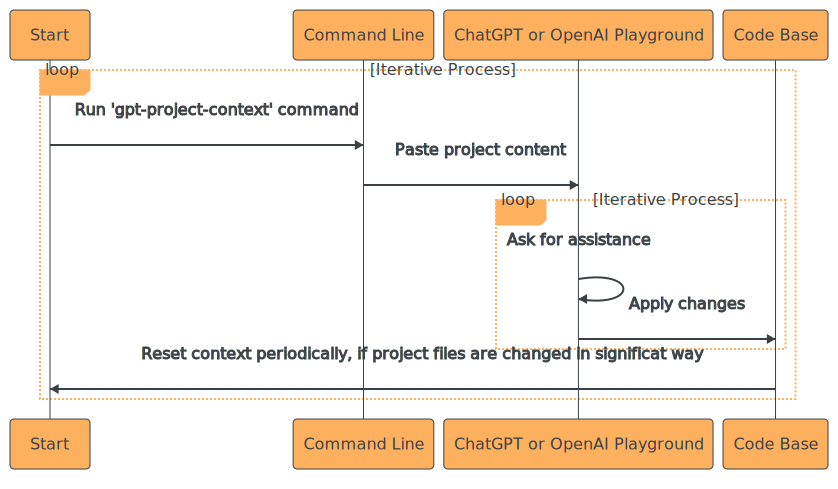

# GPT Project Context


`gpt-project-context` is a command-line tool that allows you to swiftly copy the content of specific project files to your clipboard. This content can then be easily pasted into the ChatGPT interface as an initial prompt, providing more accurate and targeted assistance from ChatGPT.

This control enables you to create precise prompts and obtain accurate assistance from ChatGPT, surpassing the capabilities of Github Copilot.

## Usage

### Typicall workflow

My typical workflow with this tool involves the following steps:

1. To obtain a list of files for a specific project, I run the command `gpt-project-context -i '**/*.js,README.md,package.json' -e '**/node_modules/*,**/dist/*'` (for a JavaScript project, for example). This command selects the desired files based on the specified patterns and copies their content to the clipboard.

2. Next, I paste the copied content as the first message in ChatGPT or OpenAI Playground. This sets the initial context for the conversation, providing relevant information about the project to assist ChatGPT in generating accurate responses.

3. I can then ask for assistance with specific tasks or questions, such as writing unit tests or debugging code.

4. After making changes to the project files or progressing further in the development process, I return to step one. This can be done by regenerating the files' content using the `gpt-project-context` command, modifying the initial message in ChatGPT, or starting a new ChatGPT session with an updated project context. This iterative process ensures that ChatGPT always has the most up-to-date information about the project, enabling it to provide accurate and relevant assistance.



### Include and Exclude Flags

`gpt-project-context` allows you to customize the files included in the output using the `-i` (include) and `-e` (exclude) flags. The `-i` flag specifies which file patterns to include, while the `-e` flag specifies which file patterns to exclude. Use standard Glob syntax for specifying file paths.

All available flags are listed below:

```txt
Usage of gpt-project-context:
  -e string
        exclude patterns (Glob syntax)
  -i string
        include patterns (Glob syntax)
  -n    no action, do not copy or write to clipboard
  -o string
        output file path
  -p string
        prompt at the beginning (default "Here is the context of my current project. Just respond with 'OK' and wait for the instructions:")
```

### Examples

#### Go:

```sh
gpt-project-context -i '**/*.go,**/*.md' -e '**/bin/*,**/specific_file.go'
```

#### JavaScript:

```sh
gpt-project-context -i '**/*.js,README.md,package.json' -e '**/node_modules/*,**/dist/*'
```

To use this tool more conveniently in a JavaScript project, add it as an npm run script in your `package.json`:

```json
{
  "scripts": {
    "context": "gpt-project-context -i '**/*.js,README.md,package.json' -e '**/node_modules/*,**/dist/*'"
  }
}
```

Now, you can simply run `npm run context` to execute the script.

## Installation

To quickly install `gpt-project-context` using binaries from GitHub release, follow the instructions for your operating system:

### macOS

```sh
# Download the binary for macOS
curl -L -o gpt-project-context "https://github.com/vlazic/gpt-project-context/releases/download/v1.0.4/gpt-project-context-macos"

# Make it executable
chmod +x gpt-project-context

# Move it to your PATH
sudo mv gpt-project-context /usr/local/bin/
```

### Windows

1. Download the `.exe` file from the [GitHub releases page](https://github.com/vlazic/gpt-project-context/releases).
2. Move the `.exe` file to a folder included in your `PATH` environment variable (e.g., `C:\Windows\System32`).

### Linux

```sh
# Download the binary for Linux
curl -L -o gpt-project-context "https://github.com/vlazic/gpt-project-context/releases/download/v1.0.4/gpt-project-context-linux"

# Make it executable
chmod +x gpt-project-context

# Move it to your PATH
sudo mv gpt-project-context /usr/local/bin/
```

## Contributing

We welcome any issues and pull requests.

If you have any questions, please feel free to open an issue.

## License

This project is licensed under the [MIT License](LICENSE).
